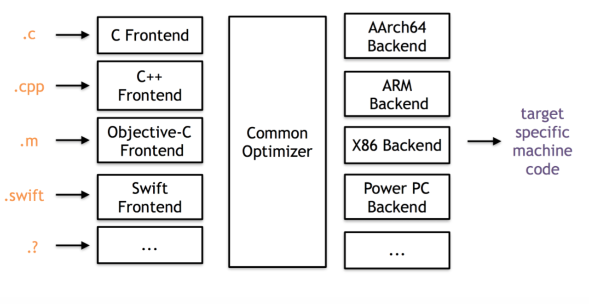

#  高级程序设计II 大实验-第一次作业

**2019201409 于倬浩**

## 前言

虽然这次作业，只要求上交代码和运行结果，但是老师在讲解说明时，我有很多具体的概念理解的并不深入，于是决定重新学习一次，并记录下学习的过程，包括中途涉及到的参考资料，以便之后参考。如果想直接看最终程序和运行结果，请跳转[这里](#最终代码&运行结果)。所有涉及的文件均以上传至[这个GitHub仓库](https://github.com/zhuohaoyu/TuringAdvancedProgramming19B)。

## 实验环境

因为虚拟机的延迟比较难受，所以直接装了双系统。

```shell
me@Narcissus-OMEN-by-HP-Laptop:~$ cat /etc/issue
Ubuntu 19.10 \n \l

me@Narcissus-OMEN-by-HP-Laptop:~$ clang -v
clang version 11.0.0 (https://github.com/llvm/llvm-project.git ca376782ff8649d1a5405123f06a742e0e94b701)
Target: x86_64-unknown-linux-gnu
Thread model: posix
InstalledDir: /usr/local/bin
Found candidate GCC installation: /usr/lib/gcc/i686-linux-gnu/9
Found candidate GCC installation: /usr/lib/gcc/x86_64-linux-gnu/9
Selected GCC installation: /usr/lib/gcc/x86_64-linux-gnu/9
Candidate multilib: .;@m64
Selected multilib: .;@m64
```

## 准备工作

首先明白我们在做什么。

先来看编译器可以划分出来的几个部分：Frontend负责把源代码转化为数据结构，Optimizer负责优化冗余的代码逻辑，后端把数据结构转化为机器码。其中LLVM的特别之处在于，可以通过不同的Frontend处理不同的语言，以便重用后面的部分。



接着，了解IR的概念：IR是intermediate representation的简写，Wikipedia给的解释是"The data structure or code used internally by a compiler or virtual machine to represent source code"。那么现在就很明确了，Frontend就是在生成IR，Optimizer是优化IR，Backend是把IR转化为机器码，整个过程就是在不断交换、处理IR。

我们这次的大作业实际上应该是在写一个Pass。官方Docs已经解释的很明白了，定义如下：

>The LLVM Pass Framework is an important part of the LLVM system, because LLVM passes are where most of the interesting parts of the compiler exist. Passes perform the transformations and optimizations that make up the compiler, they build the analysis results that are used by these transformations, and they are, above all, a structuring technique for compiler code.

接下来，了解如何写出一个Pass，以及其中的各个结构，这一点在官方的Docs上也有一篇介绍：[Writing An LLVM Pass](http://llvm.org/docs/WritingAnLLVMPass.html)

由于篇幅较长，在此不再赘述，不同点在于以上实例实现了一个Function Pass，不过结构上与我们这次要写的Module Pass相同。

现在，来考虑程序的具体实现。首先需要知道Module、Function、BasicBlock的一些基本关系：

>Module::iterator – Modules are translation units – Iterates through functions in the module
>
>Function::iterator – Iterates through a function's basic blocks 
>
>BasicBlock::iterator – Iterates through instructions in a block

在[CMU的课件](https://www.cs.cmu.edu/afs/cs/academic/class/15745-s14/public/lectures/L6-LLVM-Part2.pdf)中，发现了这样一个有趣的Tip：

>● Use ++i rather than i++ and pre-compute the end
>
>Avoid problems with iterators doing unexpected things while you are iterating – Especially for fancier iterators

下面列出几个重要的函数，在程序中可以使用到：

```c++
//Module.h  
  /// Get a short "name" for the module.
  ///
  /// This is useful for debugging or logging. It is essentially a convenience
  /// wrapper around getModuleIdentifier().
  StringRef getName() const { return ModuleID; }

//Value.h
  /// Return a constant reference to the value's name.
  ///
  /// This guaranteed to return the same reference as long as the value is not
  /// modified.  If the value has a name, this does a hashtable lookup, so it's
  /// not free.
  StringRef getName() const;

//BasicBlock.h
  /// Returns the terminator instruction if the block is well formed or null
  /// if the block is not well formed.
  const Instruction *getTerminator() const LLVM_READONLY;
  Instruction *getTerminator() {
    return const_cast<Instruction *>(
        static_cast<const BasicBlock *>(this)->getTerminator());
  }

//Instructions.h
  /// Return the specified successor. This instruction must be a terminator.
  BasicBlock *getSuccessor(unsigned Idx) const;
```

这样，稍稍理解了LLVM的核心数据结构，剩下的工作就很简单了。

## 最终代码&运行结果

```c++
//MyPass.cpp
#include <queue>          //bfs
#include <unordered_set>  //mark visited BBs

#include "llvm/IR/CFG.h"
#include "llvm/IR/Function.h"
#include "llvm/IR/Instructions.h"
#include "llvm/IR/Intrinsics.h"
#include "llvm/IR/LegacyPassManager.h"
#include "llvm/IR/Module.h"
#include "llvm/Pass.h"
#include "llvm/Support/raw_ostream.h"
#include "llvm/Transforms/IPO/PassManagerBuilder.h"

using namespace llvm;

namespace {

class MyPass : public ModulePass {
public:
    static char ID;
    std::unordered_set<void *> st;
    MyPass() : ModulePass(ID) {}

    void visitBasicBlock(BasicBlock &bb) {//访问BasicBlock并打标记
        if (st.count(&bb))
            return;
        else
            st.insert(&bb);
        errs() << "      # BasicBlock:" << &bb << '\n';
        errs() << "        > Successors:\n";
        auto termInst = bb.getTerminator();
        int numSucc = termInst->getNumSuccessors();
        for (int i = 0; i < numSucc; ++i) {
            BasicBlock &cur = *termInst->getSuccessor(i);
            errs() << "          :  " << &cur << '\n';
        }
        errs() << "        > Predecessors:\n";
        for (auto it = pred_begin(&bb), ed = pred_end(&bb); it != ed; ++it) {
            BasicBlock *cur = *it;
            errs() << "          :  " << cur << '\n';
        }
        errs() << "        > Instructions:\n";
        for (auto it = bb.begin(); it != bb.end(); ++it) {
            Instruction *ii = &*it;
            errs() << "          :" << *ii << "\n";
        }
    }

    void dfsBasicBlock(BasicBlock &bb) {
        visitBasicBlock(bb);
        auto termInst = bb.getTerminator();
        int numSucc = termInst->getNumSuccessors();
        for (int i = 0; i < numSucc; ++i) {
            BasicBlock &cur = *termInst->getSuccessor(i);
            dfsBasicBlock(cur);
        }
    }

    void dfsFunction(Function &f) {
        errs() << "  + Function(DFS):" << f.getName() << '\n';
        st.clear();
        if (f.empty()) {
            errs() << "    # Empty Function. Skipping.\n";
            return;
        }
        dfsBasicBlock(f.getEntryBlock());
    }
    void bfsFunction(Function &f) {
        errs() << "  + Function(BFS):" << f.getName() << '\n';
        if (f.empty()) {
            errs() << "    # Empty Function. Skipping.\n";
            return;
        }
        st.clear();
        std::queue<BasicBlock *> q;
        q.push(&f.getEntryBlock());
        while (!q.empty()) {
            if (st.count(q.front())) {
                q.pop();
                continue;
            }
            BasicBlock &cur = *q.front();
            q.pop();
            visitBasicBlock(cur);
            auto termInst = cur.getTerminator();
            int numSucc = termInst->getNumSuccessors();
            for (int i = 0; i < numSucc; ++i)
                q.push(termInst->getSuccessor(i));
        }
    }

    virtual bool runOnModule(Module &M) {
        errs() << "Module:" << M.getName() << '\n';
        for (auto iter = M.begin(); iter != M.end(); iter++) {
            Function &F = *iter;
            dfsFunction(F);
            bfsFunction(F);
        }
        return false;
    }
};
}  // namespace

char MyPass::ID = 0;

static void registerMyPass(const PassManagerBuilder &PMB, legacy::PassManagerBase &PM) {
    PM.add(new MyPass());
}

// works with "-O0" or no optimization options
static RegisterStandardPasses RegisterMyPass_OPT0(PassManagerBuilder::EP_EnabledOnOptLevel0, registerMyPass);

// works with "-O1", "-O2", ...
static RegisterStandardPasses RegisterMyPass_OPT(PassManagerBuilder::EP_ModuleOptimizerEarly, registerMyPass);
```

对应输出(DFS+BFS，好长啊)：

```
Module:TestMe.c
  + Function(DFS):TestMe
      # BasicBlock:0x5582f5a3dcb0
        > Successors:
          :  0x5582f5a3cf20
          :  0x5582f5a3d350
        > Predecessors:
        > Instructions:
          :  %3 = alloca i32, align 4
          :  %4 = alloca i16, align 2
          :  %5 = alloca i32, align 4
          :  %6 = alloca i32, align 4
          :  %7 = alloca i32, align 4
          :  store i32 %0, i32* %3, align 4
          :  store i16 %1, i16* %4, align 2
          :  %8 = load i32, i32* %3, align 4
          :  %9 = icmp sgt i32 %8, 10
          :  br i1 %9, label %10, label %26
      # BasicBlock:0x5582f5a3cf20
        > Successors:
          :  0x5582f5a3f080
          :  0x5582f5a3f120
          :  0x5582f5a3f760
        > Predecessors:
          :  0x5582f5a3dcb0
        > Instructions:
          :  %11 = load i32, i32* %3, align 4
          :  %12 = load i16, i16* %4, align 2
          :  %13 = sext i16 %12 to i32
          :  %14 = mul nsw i32 %11, %13
          :  store i32 %14, i32* %5, align 4
          :  %15 = load i32, i32* %5, align 4
          :  switch i32 %15, label %22 [
    i32 3, label %16
    i32 5, label %20
  ]
      # BasicBlock:0x5582f5a3f080
        > Successors:
          :  0x5582f5a3efd0
        > Predecessors:
          :  0x5582f5a3cf20
        > Instructions:
          :  %23 = load i32, i32* %5, align 4
          :  %24 = srem i32 %23, 7
          :  store i32 %24, i32* %6, align 4
          :  br label %25
      # BasicBlock:0x5582f5a3efd0
        > Successors:
          :  0x5582f5a3d2b0
        > Predecessors:
          :  0x5582f5a3f080
          :  0x5582f5a3f760
          :  0x5582f5a3f120
        > Instructions:
          :  br label %36
      # BasicBlock:0x5582f5a3d2b0
        > Successors:
          :  0x5582f5a40520
          :  0x5582f5a405c0
        > Predecessors:
          :  0x5582f5a40090
          :  0x5582f5a3efd0
        > Instructions:
          :  %37 = load i32, i32* %5, align 4
          :  %38 = load i32, i32* %6, align 4
          :  %39 = call i32 @test(i32 %37, i32 %38)
          :  %40 = icmp ne i32 %39, 0
          :  br i1 %40, label %41, label %44
      # BasicBlock:0x5582f5a40520
        > Successors:
          :  0x5582f5a40570
        > Predecessors:
          :  0x5582f5a3d2b0
        > Instructions:
          :  %42 = load i32, i32* %5, align 4
          :  %43 = call i32 @foo(i32 %42)
          :  store i32 %43, i32* %7, align 4
          :  br label %47
      # BasicBlock:0x5582f5a40570
        > Successors:
        > Predecessors:
          :  0x5582f5a405c0
          :  0x5582f5a40520
        > Instructions:
          :  %48 = load i32, i32* %7, align 4
          :  ret i32 %48
      # BasicBlock:0x5582f5a405c0
        > Successors:
          :  0x5582f5a40570
        > Predecessors:
          :  0x5582f5a3d2b0
        > Instructions:
          :  %45 = load i32, i32* %6, align 4
          :  %46 = call i32 @bar(i32 %45)
          :  store i32 %46, i32* %7, align 4
          :  br label %47
      # BasicBlock:0x5582f5a3f120
        > Successors:
          :  0x5582f5a3efd0
        > Predecessors:
          :  0x5582f5a3cf20
        > Instructions:
          :  %17 = load i16, i16* %4, align 2
          :  %18 = sext i16 %17 to i32
          :  %19 = call i32 @xfunc(i32 %18)
          :  store i32 %19, i32* %6, align 4
          :  br label %25
      # BasicBlock:0x5582f5a3f760
        > Successors:
          :  0x5582f5a3efd0
        > Predecessors:
          :  0x5582f5a3cf20
        > Instructions:
          :  %21 = call i32 (...) @yfunc()
          :  store i32 %21, i32* %6, align 4
          :  br label %25
      # BasicBlock:0x5582f5a3d350
        > Successors:
          :  0x5582f5a3fc20
          :  0x5582f5a40090
        > Predecessors:
          :  0x5582f5a3dcb0
        > Instructions:
          :  %27 = load i16, i16* %4, align 2
          :  %28 = sext i16 %27 to i32
          :  %29 = icmp sgt i32 %28, 0
          :  br i1 %29, label %30, label %35
      # BasicBlock:0x5582f5a3fc20
        > Successors:
          :  0x5582f5a40090
        > Predecessors:
          :  0x5582f5a3d350
        > Instructions:
          :  %31 = load i16, i16* %4, align 2
          :  %32 = sext i16 %31 to i32
          :  %33 = shl i32 %32, 3
          :  %34 = sdiv i32 %33, 11
          :  store i32 %34, i32* %6, align 4
          :  br label %35
      # BasicBlock:0x5582f5a40090
        > Successors:
          :  0x5582f5a3d2b0
        > Predecessors:
          :  0x5582f5a3fc20
          :  0x5582f5a3d350
        > Instructions:
          :  br label %36
  + Function(BFS):TestMe
      # BasicBlock:0x5582f5a3dcb0
        > Successors:
          :  0x5582f5a3cf20
          :  0x5582f5a3d350
        > Predecessors:
        > Instructions:
          :  %3 = alloca i32, align 4
          :  %4 = alloca i16, align 2
          :  %5 = alloca i32, align 4
          :  %6 = alloca i32, align 4
          :  %7 = alloca i32, align 4
          :  store i32 %0, i32* %3, align 4
          :  store i16 %1, i16* %4, align 2
          :  %8 = load i32, i32* %3, align 4
          :  %9 = icmp sgt i32 %8, 10
          :  br i1 %9, label %10, label %26
      # BasicBlock:0x5582f5a3cf20
        > Successors:
          :  0x5582f5a3f080
          :  0x5582f5a3f120
          :  0x5582f5a3f760
        > Predecessors:
          :  0x5582f5a3dcb0
        > Instructions:
          :  %11 = load i32, i32* %3, align 4
          :  %12 = load i16, i16* %4, align 2
          :  %13 = sext i16 %12 to i32
          :  %14 = mul nsw i32 %11, %13
          :  store i32 %14, i32* %5, align 4
          :  %15 = load i32, i32* %5, align 4
          :  switch i32 %15, label %22 [
    i32 3, label %16
    i32 5, label %20
  ]
      # BasicBlock:0x5582f5a3d350
        > Successors:
          :  0x5582f5a3fc20
          :  0x5582f5a40090
        > Predecessors:
          :  0x5582f5a3dcb0
        > Instructions:
          :  %27 = load i16, i16* %4, align 2
          :  %28 = sext i16 %27 to i32
          :  %29 = icmp sgt i32 %28, 0
          :  br i1 %29, label %30, label %35
      # BasicBlock:0x5582f5a3f080
        > Successors:
          :  0x5582f5a3efd0
        > Predecessors:
          :  0x5582f5a3cf20
        > Instructions:
          :  %23 = load i32, i32* %5, align 4
          :  %24 = srem i32 %23, 7
          :  store i32 %24, i32* %6, align 4
          :  br label %25
      # BasicBlock:0x5582f5a3f120
        > Successors:
          :  0x5582f5a3efd0
        > Predecessors:
          :  0x5582f5a3cf20
        > Instructions:
          :  %17 = load i16, i16* %4, align 2
          :  %18 = sext i16 %17 to i32
          :  %19 = call i32 @xfunc(i32 %18)
          :  store i32 %19, i32* %6, align 4
          :  br label %25
      # BasicBlock:0x5582f5a3f760
        > Successors:
          :  0x5582f5a3efd0
        > Predecessors:
          :  0x5582f5a3cf20
        > Instructions:
          :  %21 = call i32 (...) @yfunc()
          :  store i32 %21, i32* %6, align 4
          :  br label %25
      # BasicBlock:0x5582f5a3fc20
        > Successors:
          :  0x5582f5a40090
        > Predecessors:
          :  0x5582f5a3d350
        > Instructions:
          :  %31 = load i16, i16* %4, align 2
          :  %32 = sext i16 %31 to i32
          :  %33 = shl i32 %32, 3
          :  %34 = sdiv i32 %33, 11
          :  store i32 %34, i32* %6, align 4
          :  br label %35
      # BasicBlock:0x5582f5a40090
        > Successors:
          :  0x5582f5a3d2b0
        > Predecessors:
          :  0x5582f5a3fc20
          :  0x5582f5a3d350
        > Instructions:
          :  br label %36
      # BasicBlock:0x5582f5a3efd0
        > Successors:
          :  0x5582f5a3d2b0
        > Predecessors:
          :  0x5582f5a3f080
          :  0x5582f5a3f760
          :  0x5582f5a3f120
        > Instructions:
          :  br label %36
      # BasicBlock:0x5582f5a3d2b0
        > Successors:
          :  0x5582f5a40520
          :  0x5582f5a405c0
        > Predecessors:
          :  0x5582f5a40090
          :  0x5582f5a3efd0
        > Instructions:
          :  %37 = load i32, i32* %5, align 4
          :  %38 = load i32, i32* %6, align 4
          :  %39 = call i32 @test(i32 %37, i32 %38)
          :  %40 = icmp ne i32 %39, 0
          :  br i1 %40, label %41, label %44
      # BasicBlock:0x5582f5a40520
        > Successors:
          :  0x5582f5a40570
        > Predecessors:
          :  0x5582f5a3d2b0
        > Instructions:
          :  %42 = load i32, i32* %5, align 4
          :  %43 = call i32 @foo(i32 %42)
          :  store i32 %43, i32* %7, align 4
          :  br label %47
      # BasicBlock:0x5582f5a405c0
        > Successors:
          :  0x5582f5a40570
        > Predecessors:
          :  0x5582f5a3d2b0
        > Instructions:
          :  %45 = load i32, i32* %6, align 4
          :  %46 = call i32 @bar(i32 %45)
          :  store i32 %46, i32* %7, align 4
          :  br label %47
      # BasicBlock:0x5582f5a40570
        > Successors:
        > Predecessors:
          :  0x5582f5a405c0
          :  0x5582f5a40520
        > Instructions:
          :  %48 = load i32, i32* %7, align 4
          :  ret i32 %48
  + Function(DFS):xfunc
    # Empty Function. Skipping.
  + Function(BFS):xfunc
    # Empty Function. Skipping.
  + Function(DFS):yfunc
    # Empty Function. Skipping.
  + Function(BFS):yfunc
    # Empty Function. Skipping.
  + Function(DFS):test
    # Empty Function. Skipping.
  + Function(BFS):test
    # Empty Function. Skipping.
  + Function(DFS):foo
    # Empty Function. Skipping.
  + Function(BFS):foo
    # Empty Function. Skipping.
  + Function(DFS):bar
    # Empty Function. Skipping.
  + Function(BFS):bar
    # Empty Function. Skipping.
```

