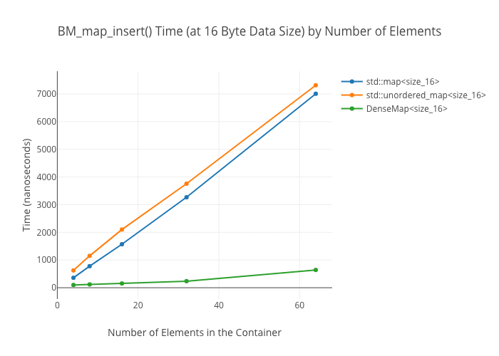
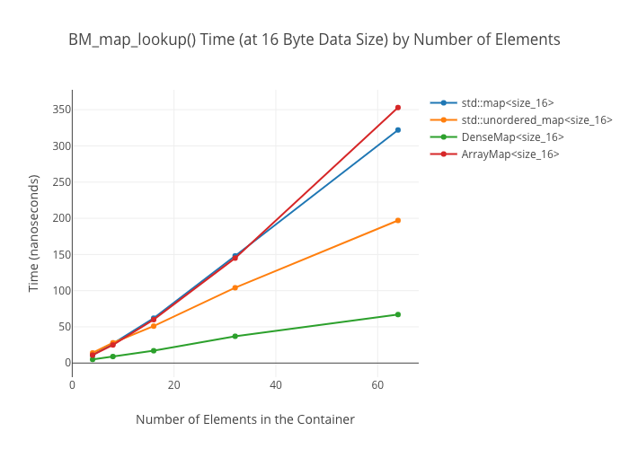
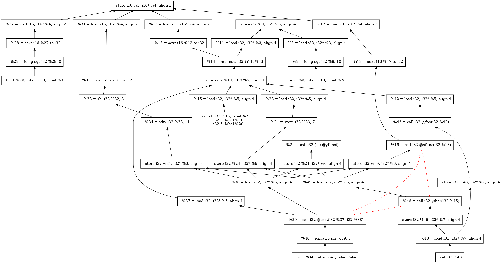
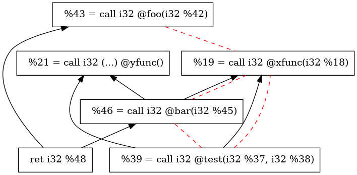
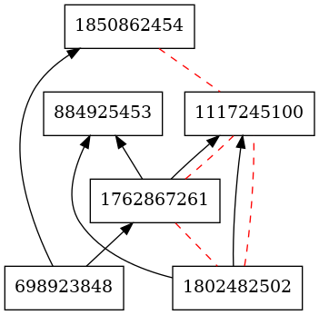
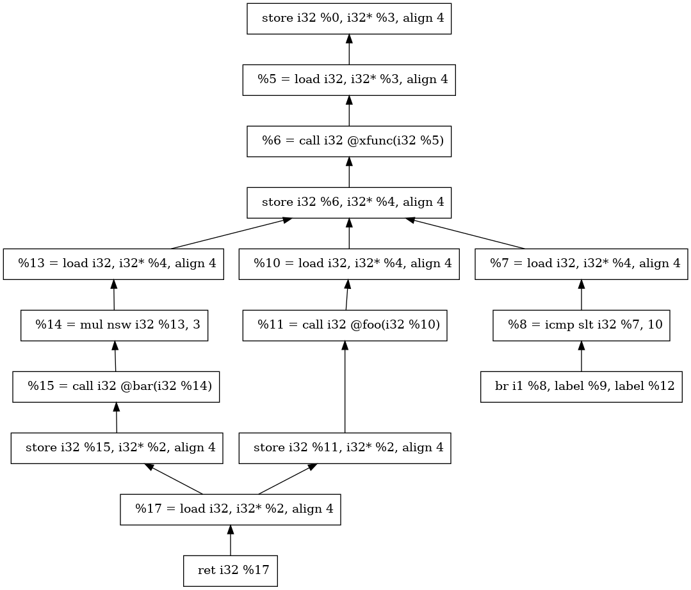
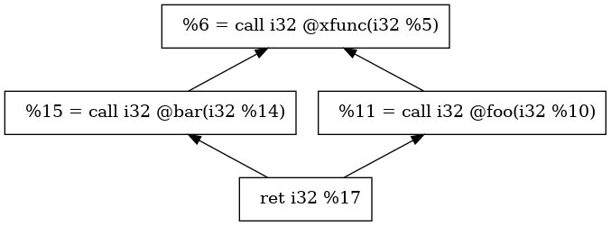
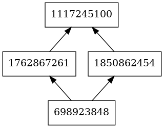

# 高级程序设计II 大实验作业二

**2019201407农钧翔 & 2019201409于倬浩 & 2019201420汪元森**

项目地址：[Github](https://github.com/zhuohaoyu/TuringAdvancedProgramming19B/tree/master/Task2)

## 实验环境

操作系统：Ubuntu 20.04 LTS

```shell
$ clang --version                 
clang version 11.0.0 (https://github.com/llvm/llvm-project.git ca376782ff8649d1a5405123f06a742e0e94b701)
Target: x86_64-unknown-linux-gnu
Thread model: posix
```

## 实现算法

**使用数据流迭代算法创建数据依赖关系**

对于每一条指令，我们需要判断它是否创建了一个变量定义（Definition），以及是否使用（Use）了其它变量的定义。对于每一处变量的使用，将之和其对应的变量定义联系起来。这样的“定义——使用”关系即为所求。

每个BB内部可能含有一些定义和使用，我们需要正确关联BB内及BB间的所有依赖关系。BB内部的定义——使用关系是很容易求出的，因为一个BB内的instruction总是顺序执行的，将每处使用和该使用之前最近的定义联系起来即可。

对于BB之间定义——使用关系，定义出现在某个BB中，而其使用则位于后继（或后继的后继等）BB中。因此，对于每一个BB，我们处理出所有能到达该BB的定义的集合bbIn，以及该BB中无法找到定义的使用的集合bbUse，将bbUse中的使用和bbIn中的定义关联起来，这样就建立了跨BB的依赖关系。

**数据流迭代算法的三个主要流程**

1. 初始化

    对于每个BB，分析每条instruction的操作类型，对于特殊格式的操作特殊判断。对于每个instruction，始终判断其是否创建了定义，如果有，则加入bbDef集合中。对于每个use，判断它的定义是否在bbDef中出现过，如果有，则直接建立依赖边，否则加入bbUse集合，等待进一步处理。注意，这里的bbDef始终只维护最后一次definition，因为位置顺序靠后的definition总会覆盖位置顺序靠前的。

2. 迭代求bbIn

    对于每个BB，维护bbIn表示所有能到达该BB的定义；维护bbOut表示，该bb运行结束后仍然有效的定义，初始化出bbGen表示在该BB中产生的有效定义（即BB初始化完成瞬间的bbDef）。

    每一次迭代，我们依次处理所有的BB。对于每个BB，bbIn用相邻前驱的bbOut的并集来更新，而bbOut为bbGen∪( bbIn – bbKill )，这里的bbKill表示该块对之前变量定义的销毁，即重定义（因为最后一次定义才是有效定义，一旦一个变量被重定义，那么它之前的定义都应该被销毁），我们可借助bbDef来检查bbIn的每个定义，并销毁不需要的定义。

    注意，这里的“依次处理”，我们选用的是bfs顺序。这通常比随机顺序速度更快。

3. 用bbIn和bbUse补全依赖关系

    现在，我们求出了每个BB的bbIn集合，bbUse集合也在“初始化”步骤中得到。可以在bbIn中，查找每一次bbUse对应的定义，并建立依赖关系。

**Flatten流程**

我们更加关心程序的函数调用及函数返回，因此，基于如上创建的依赖关系图，我们可以得出一个简化版本的依赖关系图（下称简化图）。简化图只包含Call和Ret的依赖关系（并不需要在原图中相邻）。

如果某依赖关系链如：Call1 -> Load2 -> Store3->Call4->Store5->Call6，我们认为简化后Call1->Call4->Call6（Call1不向Call6直接连边，因为Call1不直接依赖Call6）。

**Flatten的实现**

显然，对于原图中所有不关心的点（非Call、Ret），我们可以将这个点去掉，然后将指向它的边与它指出的边两两对接，但该操作较为繁琐。

我们采用一种简单粗暴的方式，即以每个关键点（Call或Ret）为起点进行bfs，一旦bfs到一个关键点，建立依赖关系，但不将这个关键点的后继加入bfs队列中。这样，我们就建立了关键点间的依赖关系。

**构建Transaction图**

在Flatten过后，由于我们想要得到更为规范化的结果，以便于快速比较不同关键点本质相同与否，我们只需在对指令规范化的基础上，对指令字符串进行Hash即可。规范化的代码采用老师已经给出的方式，将指令规范化后返回一个字符串。

对于Hash部分，我们选用了碰撞概率较低，总体表现较为优秀的BKDRHash算法，将string转化为一个整数。

需要注意的是，尽管我们在这个大作业的*.transaction.jpg中仅将每个节点用一个整数表示，这样仍有较小的碰撞的可能。为了确保在未来实现的功能中尽可能不出现碰撞，BKDRHash函数支持不同的seed，我们将会对同一个string使用两个不同的且互质的seed计算出两个Hash值，只有两个Hash值都相同时，才会判定为两个指令本质相同。


## 数据结构

在计算数据依赖关系时，新定义了Use类，对于每一个Value维护对应的Instruction的集合，表示数据使用关系。Use类内维护了一个键值为Value*，存储值为set指针的map。提供了createUse()和deleteUse()两个接口，分别表示创建/删除某个使用关系。

性能方面，注意到程序中大量使用map和set的嵌套，这样最坏的时间复杂度为$$O(nlog^3n)$$，查阅资料得知LLVM自带的DenseMap实现了一个带有二次探测的哈希表，均摊时间空间复杂度为$$O(1)$$，优于stl::map和stl::unordered_map，而且在这个项目中，我们并不依赖map的有序特性，因此直接将所有的map换成DenseMap可以通过消耗稍多一点的空间，减少大量时间消耗。这种方法唯一的缺点在于DenseMap会在初始化时分配一些空间，增加了空间消耗。

下面是StackOverflow上关于DenseMap和map的性能对比：





## 运行结果

```shell
$ make && ./analyze.sh
`llvm-config --bindir`/clang `llvm-config --cxxflags` -shared -fPIC `llvm-config --ldflags` -o MyPass.so SimpleDataDependenceGraph.cpp MyPass.cpp 
Module:TestMe.c
 + Function:TestMe
 + Function:xfunc
   - Empty Function
 + Function:yfunc
   - Empty Function
 + Function:test
   - Empty Function
 + Function:foo
   - Empty Function
 + Function:bar
   - Empty Function
 + Function:TestMe_other
```


由于加边顺序不同，得出的图片会与标准图片样子不太一样，但是点和边的关系相同。



<center> TestMe.png<center/>




<center> TestMe.flat.png<center/>




<center> TestMe.transaction.png<center/>

​    



<center> TestMe_other.png <center/>
    
</center>




<center> TestMe_other.flat.png <center/>




<center> TestMe_other.transaction.png <center/>

