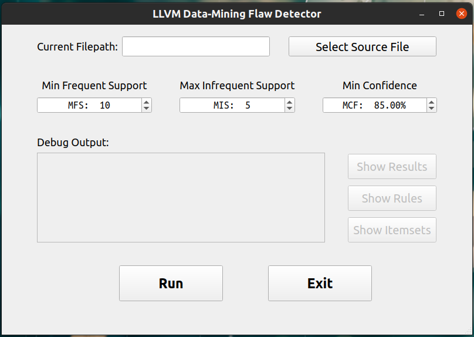
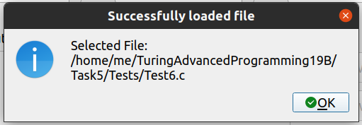
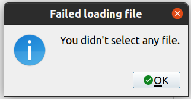
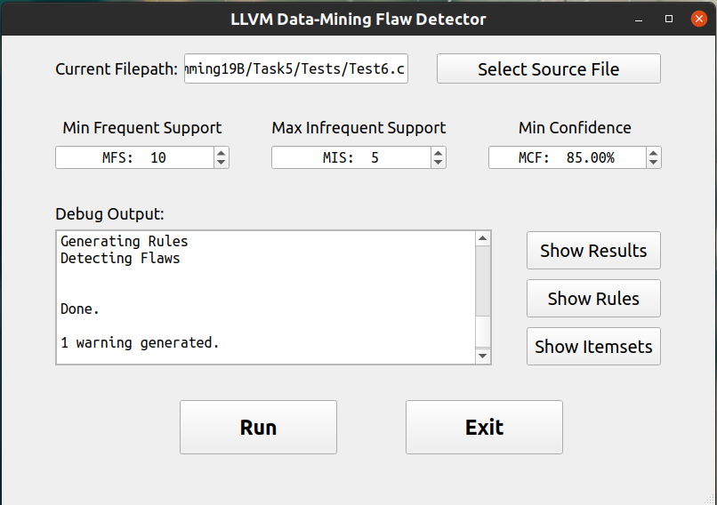
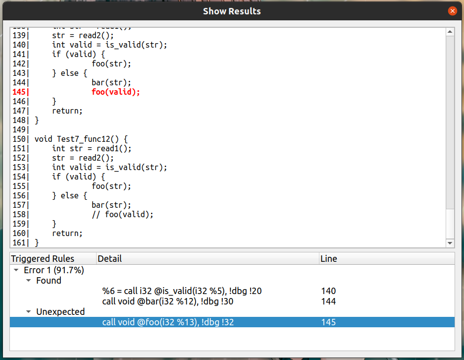
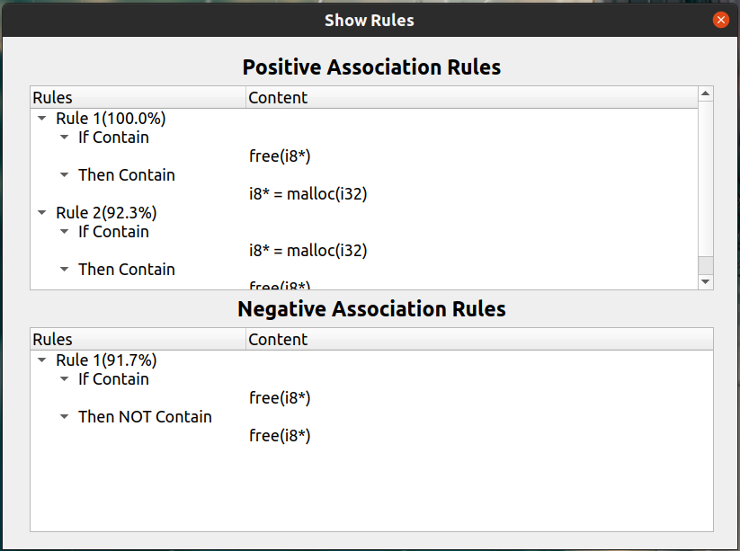
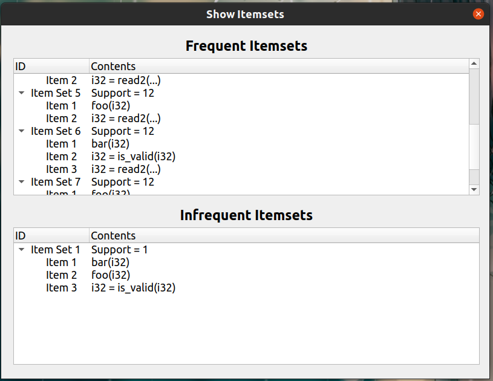

# 高级程序设计II 大作业实验报告

项目地址：[GitHub](https://github.com/zhuohaoyu/TuringAdvancedProgramming19B)

## 代码贡献

+ 农钧翔 2019201407：
    + 实现迭代数据流算法 & 构建``Flatten``图（Task2）
    + 生成关联规则及置信度（Task3）
    + 库函数对接与格式化输出（Task4）

+ 于倬浩 2019201409：
    + 构建``Transaction``图 & 规范化指令（Task2）
    + 实现``Apriori``算法生成项集（Task3）
    + 图形化界面 & 对接动态链接库的输出（Task5）

+ 汪元森 2019201420：
    + 初始化数据流算法（Task2）
    + 实现``calcu_support``计算项集的支持度（Task3）
    + 缺陷检测算法的实现（Task4）

## 实验环境

操作系统：``Ubuntu 20.04 LTS``

```shell
$ clang --version                 
clang version 10.0.0
Target: x86_64-pc-linux-gnu
Thread model: posix
InstalledDir: /usr/bin
$ qmake --version
QMake version 3.1
Using Qt version 5.12.8 in /usr/lib/x86_64-linux-gnu
```

## 简单介绍

本次UI的实现采用了QT5，实现了一个简单的多窗口程序，主窗口初始状况下如下图所示：



### 指定运行参数

支持指定需要检测的源文件位置，指定``MFS``、``MIS``、``MCF``的值。

选择文件的``PushButton``通过调用``QFileDialog``，调用系统选择文件的窗口，较为美观，同时限定用户只能选择C/C++源代码文件。文件选择结束后，调用``QMessageBox``给出反馈，同时将文件目录更新至主窗口的`lineEdit`中。

对于三个指定值的输入，选用了``spinbox``，以便控制输入值的上下界、步长等。




### 运行检测

选定源文件，指定参数后，单击"``Run``"即可运行检测。运行过程中，所有设定参数的按钮均被禁用，运行结束后重新启用这些按钮。运行过程中，动态链接库``MyPass.so``输出适当的调试信息至标准错误流``stderr``中，并即时反馈至"Debug Output"中。

运行过程中的结果，由``MyPass.so``输出至``stdout``中，使用不同的token区分输出类型。``MyPass.so``在成功执行结束后，在``stdout``中返回一个token``"$$SUCCESS"``，UI在读取到这个token后，才会启用右侧的三个按钮。同时在文件路径更新后，亦会禁用展示结果的按钮。




### 查看结果

成功运行检测后，右侧的三个按钮"``Show Result``","``Show Rules``", "``Show Itemsets``"可被启用。

单击``Show Results``，弹出一个包含``QTreeView``组件和一个``QTextView``组件的新窗口，展示了匹配到的可能缺陷，对应的置信度，以及缺陷指令及对应源文件的行号。用户在Tree View中单击某条行号后，会在上方的源文件中将光标自动定位到指定行，加粗并标红对应代码。选择另一条行号后，上一次高亮的一行将恢复初始状态。



单击``Show Rules``，弹出一个包含两个``QTreeView``组件的新窗口，分别展示了所有的正关联规则和负关联规则以及对应置信度。



单击``Show Itemsets``，弹出一个包含两个``QTreeView``组件的新窗口，展示了所有的频繁/非频繁项集以及对应的支持度。

